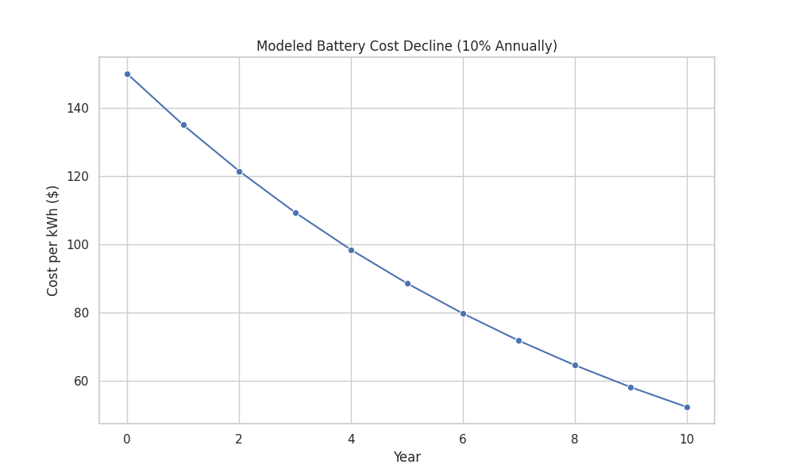
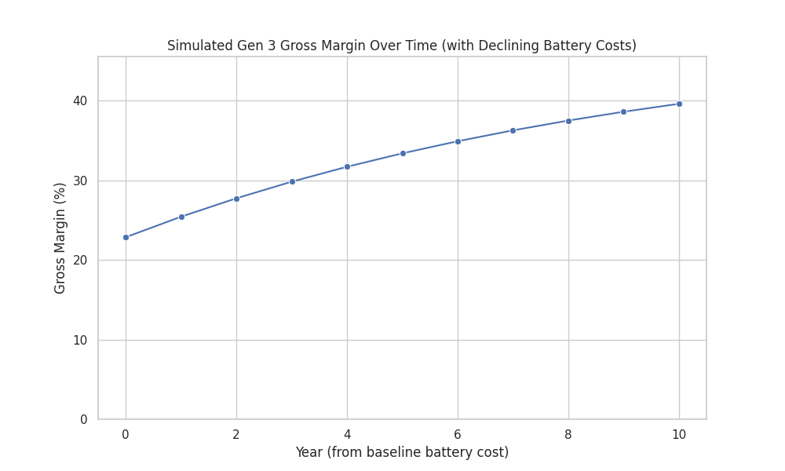

# Tesla Motors: Strategy and Future

## 1. Executive Summary

This report reviews Tesla Motors, Inc.'s strategy, using the case study. In early 2013, Tesla first made profits with its Model S car. This was a major step in the difficult car industry. The company has new ideas for electric vehicle (EV) design. It sells directly to customers. Its bold "Master Plan" makes it a company that changes the game. But Tesla also has big challenges. It needs to make more cars. It has high costs for research (R&D) and factories. It faces tough dealership laws. It also needs to keep making profits as it plans to build cars for more people (Gen 3). Key chances for Tesla are cheaper batteries, being a tech leader, a strong brand, and the growing EV market.

## 2. Key Findings

*   **Making Profits, But Growth is Key:** Tesla showed it could make a profit with the Model S car. (The H1 2013 Gross Margin was about 20.35%.) But R&D costs were still high. (H1 2013 R&D was about 11.08% of sales.) This means Tesla focused on new ideas more than quick profits. Tesla must keep making profits and grow with future cars that sell in larger numbers.
*   **New Sales Model, Legal Problems:** Tesla sells cars directly to people and offers its own service. This gives them control over their brand and how customers feel. But, this method goes against current dealership laws in many U.S. states. This leads to ongoing legal fights (for example, in Texas and North Carolina).
*   **Battery Costs Affect Competition:** Battery costs are a big part of making EVs. Tesla plans to use standard battery cells (18650). It also plans to make many of them (like with the Gigafactory idea). This is very important. Our studies show that if battery costs fall 10% each year, profits on future cars could go up a lot.
*   **"Master Plan" Guides the Future:** Elon Musk's plan for Tesla is to first sell expensive cars (like the Roadster and Model S). Then, he will use those profits to build cheaper electric cars for more people (like the "Gen 3" model).
*   **Making Cars and Managing Costs are Vital:** Tesla bought the NUMMI factory and tools at good prices. But, making more cars well and handling high costs for design, R&D, and making parts are still big issues.

## 3. Analysis of Tesla's Strategy

### Cost Structure

Tesla's costs include big spending on R&D. It also has high costs to set up factories. Tesla makes key parts like motors and battery packs itself.
*   **Past Money Performance (Tesla):**
    *   Gross Profit Margin (profit from sales after direct costs): H1 2013: 20.35%; 2012: 7.28%; 2011: 30.16%; 2010: 26.32%. The 2011/2010 numbers were likely higher due to the expensive Roadster.
    *   R&D as % of Sales: H1 2013: 11.08%; 2012: 66.30%; 2011: 102.32%; 2010: 79.66%.
    *   Compare this to BMW: Gross Profit Margin of 29.53% and R&D at 6.97% of sales in 2012.
*   **Main Cost Drivers:** Designing cars (Model S design cost about $0.5 billion). Making battery packs (a 60kWh Model S pack cost about $15,000-$18,000). Increasing car production.
*   **Efforts to Control Costs:** Buying the NUMMI factory and tools cheaply helped cut early costs. Making many parts in its own factory (like 90% of Model S plastic parts) gives Tesla control but also makes things more complex.

### Sales Model

Tesla sells cars and gives service directly to people. It does not use normal car dealers.
*   **How It Works:** Tesla has its own stores, often in busy shopping areas. Staff earn a salary, not a sales bonus. Service is done at Tesla service centers, by mobile teams ("Tesla Rangers"), or by picking up cars.
*   **Why This Way:** Elon Musk said normal dealers have a problem selling both gas and electric cars. A direct model lets Tesla teach people about EVs and control their buying experience.
*   **Good Points:** Full control over brand, price, and customer relations. Tesla can teach people about EV technology directly.
*   **Problems:** Big legal fights from dealer groups. Many states have laws that stop car makers from selling directly. This has limited sales in states like Texas.

### Battery Economics

Battery technology and cost are very important for Tesla's plan and how it competes.
*   **Technology:** Tesla used standard 18650 lithium-ion battery cells. (The Roadster had almost 7,000 cells; the 85kWh Model S had over 7,000). It worked with Panasonic to get and change these cells. Other car makers were making special cells just for cars.
*   **Cost Savings:** The case study notes Tesla's battery pack cost per kWh for the Model S was about half of Nissan Leaf's. Battery costs were falling by about 10% a year from 2009 to 2012.
*   **Future Cost Drop Model:** A 10% yearly drop from a starting price of $150/kWh is predicted:
    
    This drop is key to making future cars, like the Gen 3, cheaper and more profitable.

### Dealership Law

Tesla's direct sales method faces strong challenges from state laws that protect car dealers.
*   **The Problem:** Many states have laws that say car makers must sell new cars through franchised dealers. Tesla's company stores break these rules.
*   **Results:** Tesla has had legal fights and sales limits in some states (like Texas and North Carolina). This makes things unsure and complex. It can also make it harder to reach customers.
*   **Tesla's Point:** Tesla says its special product and sales way need a direct model. It also says current laws are unfair to new EV companies.

### Master Plan

Elon Musk explained Tesla's long-term plan in a 2006 blog post:
1.  Build a sports car (the Roadster).
2.  Use money from that car to build a cheaper car (the Model S).
3.  Use that money to build an even cheaper car (the future "Gen 3" car, to cost about $35,000).
The main aim is to speed up the change to clean transport. Tesla wants to bring great electric cars to many people, quickly. Profits from costly cars are used for R&D and to make more of the next, cheaper cars.

## 4. Financial Outlook & Future Numbers

### Past Financial Numbers (from Case Exhibits)

*   **Tesla Motors (US$ thousands, unless noted):**
    *   Gross Profit Margin: 20.35% (H1 2013); 7.28% (2012); 30.16% (2011)
    *   R&D as % of Sales: 11.08% (H1 2013); 66.30% (2012); 102.32% (2011)
    *   Asset Turnover (how well Tesla uses assets to make money): 1.02 (Jun-13); 0.37 (Dec-12)
*   **BMW Group (million Euros, unless noted):**
    *   Gross Profit Margin: 29.53% (2012); 30.51% (2011)
    *   R&D as % of Sales: 6.97% (2012); 7.04% (2011)

These numbers show Tesla's profit margin from sales improved by H1 2013. But its R&D spending was very high next to its sales. This is common for a growing company with new ideas. The asset turnover shows Tesla was using its money and equipment better over time.

### Future 2024 Numbers (Example Only - Not Real Data)

*Actual 2024 data is not in this study. These numbers are just examples:*
*   Example 2024 Revenue: $85,000,000 (thousands)
*   Example 2024 Gross Margin: 20.00%
*   Example 2024 R&D Use (R&D as % of Sales): 5.88%
*   Example 2024 Money Used (Capital Employed): $80,000,000 (thousands)
*   Example 2024 Money Use Rate (Revenue / Capital Employed): 1.06

These made-up numbers suggest Tesla selling much more. It would keep a good gross margin (like H1 2013). It would spend less of its sales on R&D as sales grow. And it would use its money well. *These are not real predictions.*

### Gen 3 Car Profit Simulation

Making a "Gen 3" car for many people is key to Tesla's Master Plan. Say the car sells for $35,000. Non-battery costs are $18,000 per car (this is a guess). The battery is 60 kWh. If battery costs fall 10% a year (from $150/kWh), the gross margin could change a lot:

*   **Year 0 (Battery Cost $150/kWh):**
    *   Battery Cost per Car: $9,000
    *   Total Cost per Car: $27,000
    *   Gross Profit per Car: $8,000
    *   **Gross Margin: ~22.86%**
*   **Year 5 (Battery Cost ~$88.57/kWh):**
    *   Battery Cost per Car: ~$5,314
    *   Total Cost per Car: ~$23,314
    *   Gross Profit per Car: ~$11,686
    *   **Gross Margin: ~33.39%**
*   **Year 10 (Battery Cost ~$52.30/kWh):**
    *   Battery Cost per Car: ~$3,138
    *   Total Cost per Car: ~$21,138
    *   Gross Profit per Car: ~$13,862
    *   **Gross Margin: ~39.61%**

This study shows that lower battery costs are very important for making EVs for many people profitable.

## 5. Strategic Challenges & Opportunities

### Challenges:
*   **Making More Cars:** Changing from making small numbers of cars (Roadster, Model S) to large numbers of the Gen 3 car is a very big test. It affects how cars are made, the parts supply, and quality.
*   **Controlling Costs & Making Profits:** Tesla needs to make steady profits. But it also spends a lot on R&D and new factories (like the Gigafactory). And it's selling to a market that is more careful about price.
*   **Dealership Law Fights:** Legal fights with state dealer groups could hurt sales in some U.S. states.
*   **Other Car Companies:** Big car companies are making more EVs. They have more money, experience, and existing dealers.
*   **Needing Money:** Tesla will keep needing lots of money for growth, R&D, and new projects.

### Opportunities:
*   **Tech Leader:** Tesla is a leader in EV technology. This includes batteries, motors, and car software.
*   **Strong Brand:** Many people know and like the Tesla brand.
*   **Cheaper Batteries:** If battery costs keep falling (helped by Tesla's own work), its cars can be cheaper and make more profit.
*   **Finishing the Master Plan:** If Tesla can launch a successful cheap Gen 3 car in large numbers, it could become a top car company.
*   **Growing EV Market:** More people are buying EVs. They worry about the environment, like the car's performance, and get help from the government. This helps Tesla grow.
*   **Making Its Own Parts:** Tesla controls key parts, from software to motors. This can help it make new things faster and manage costs, if done well.

## 6. Conclusion & Recommendations

Tesla Motors is a new kind of company. It has changed the car industry. It makes electric cars that people want, that perform well, and that are easier to own. Its new ideas, strong leader, and big goals are key strengths. But, making cars costs a lot. Tesla has big tasks to grow, manage costs, and handle laws and other companies.

**Recommendations:**

1.  **Lead in Batteries:** Keep working hard to lower battery costs. Do this through R&D, working with partners (like Panasonic), and building big factories (like the Gigafactory). This is key for Gen 3 success.
2.  **Handle Legal Issues Smartly:** Talk with lawmakers. Find new ways to sell and service cars. This can reduce problems from dealership laws. Also, keep trying to sell directly where possible.
3.  **Be Great at Mass Production:** Focus on making cars very well and efficiently. This will help meet Gen 3 sales and cost goals. Learn from past problems. Build strong supply chains for parts.
4.  **Keep Making New Things:** Continue to spend on R&D. Stay ahead in EV tech, self-driving features, and car software. These make Tesla special.
5.  **Manage Money Well:** Balance big growth plans with careful spending. Have a clear plan to make steady profits. This will keep investors happy.

Tesla's path is risky but could bring big rewards. Success depends on finishing its Master Plan. This means becoming a car maker for many people. It must also manage its money, factories, and legal issues well.
